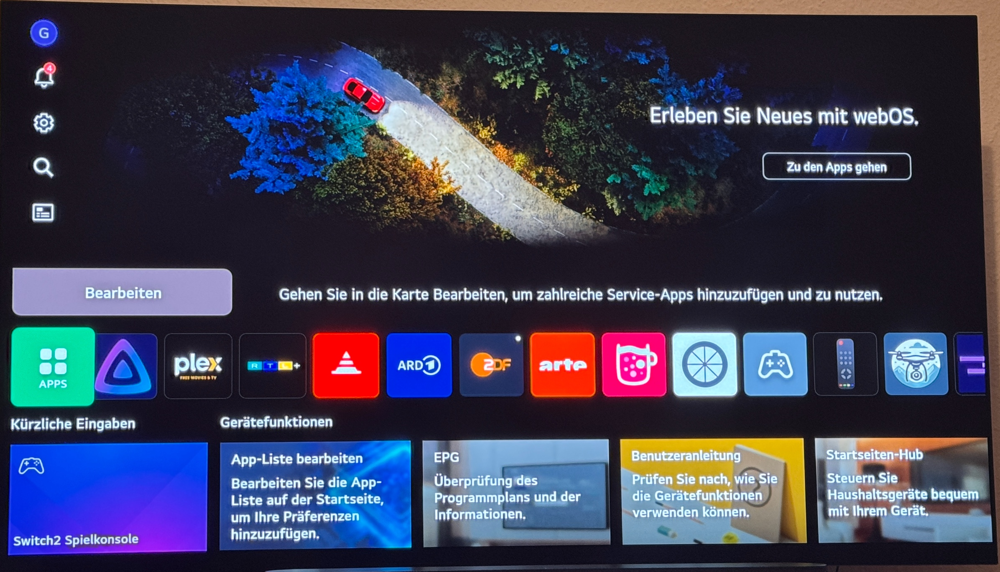
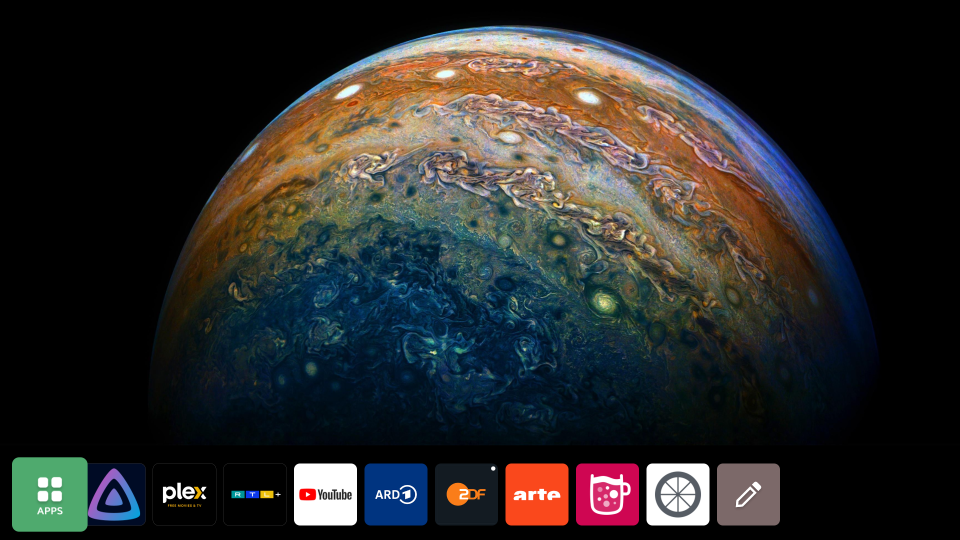

# Customizing the LG WebOS 10 / WebOS25 Homescreen

How to replace the background image, remove unwanted UI elements, and change system text on your LG TV — no permanent changes to the read-only filesystem.

> **Tested on:** LG WebOS 10.2.2 (Rockhopper), EU region  
> **Requirements:** Root access, active SSH connection, Homebrew Channel with `webosbrew` init.d support

---

# Before / After
## Before

## After



## Background

On WebOS 10, the Home app has been completely rewritten in **Flutter** (unlike older versions which used QML). The layout is controlled by XML files, and UI text comes from locale JSON files — all inside the app's Flutter assets directory:

```
/usr/palm/applications/com.webos.app.home/data/flutter_assets/assets/
```

This directory is on a read-only, cryptographically signed filesystem, so we can't edit files directly. Instead, we use a **bind mount overlay**: copy the assets to a writable location in `/tmp`, apply our modifications, and mount that over the original directory. The original files are never touched.

One important detail: the `i18n` folder inside assets is a **symlink** to another read-only partition. If you want to modify locale files (e.g. to change or remove UI text), you need to replace the symlink with a real directory first. The apply script below handles this automatically.

---

## Directory Structure

Create your working directory on the writable developer partition:

```sh
mkdir -p /media/developer/apps/usr/palm/applications/tld.my.customhome/assets/images/hd
mkdir -p /media/developer/apps/usr/palm/applications/tld.my.customhome/assets/images/2k
mkdir -p /media/developer/apps/usr/palm/applications/tld.my.customhome/assets/images/4k
mkdir -p /media/developer/apps/usr/palm/applications/tld.my.customhome/assets/i18n
```

---

## The apply.sh Script

This script copies the original assets to `/tmp`, replaces the i18n symlink with a real directory, overlays your modifications, mounts the result over the original directory, and restarts the Home app.

```sh
cat > /media/developer/apps/usr/palm/applications/tld.my.customhome/apply.sh << 'EOF'
#!/bin/sh

set -e -x

ASSETS_DIR=/usr/palm/applications/com.webos.app.home/data/flutter_assets/assets
OVERRIDE_DIR=/media/developer/apps/usr/palm/applications/tld.my.customhome/assets

umount "$ASSETS_DIR" 2>/dev/null || true
rm -rf /tmp/weboshome-merged
mkdir /tmp/weboshome-merged
cp -R --no-dereference "$ASSETS_DIR"/. /tmp/weboshome-merged/

# Replace i18n symlink with real directory
rm /tmp/weboshome-merged/i18n
cp -R "$OVERRIDE_DIR/i18n" /tmp/weboshome-merged/i18n

# Copy rest of overrides
cp -R "$OVERRIDE_DIR"/home.xml /tmp/weboshome-merged/
cp -R "$OVERRIDE_DIR"/home_layoutShelfView.xml /tmp/weboshome-merged/
cp -R "$OVERRIDE_DIR"/images/. /tmp/weboshome-merged/images/

mount --bind /tmp/weboshome-merged "$ASSETS_DIR"
pkill -f com.webos.app.home || true
EOF

chmod +x /media/developer/apps/usr/palm/applications/tld.my.customhome/apply.sh
```

> The `umount` at the start ensures the script is safe to run multiple times without errors.

---

## Removing Unwanted UI Elements

The layout is defined in two XML files. Copy them into your override directory first:

```sh
cp /usr/palm/applications/com.webos.app.home/data/flutter_assets/assets/home.xml \
   /media/developer/apps/usr/palm/applications/tld.my.customhome/assets/home.xml

cp /usr/palm/applications/com.webos.app.home/data/flutter_assets/assets/home_layoutShelfView.xml \
   /media/developer/apps/usr/palm/applications/tld.my.customhome/assets/home_layoutShelfView.xml
```

### Remove the Recommended Shelf

The `recommendedShelf` is the large content recommendation strip at the bottom of the screen (531px tall), loaded dynamically from LG's servers.

```sh
sed -i '/<item id="recommendedShelf"/d' \
    /media/developer/apps/usr/palm/applications/tld.my.customhome/assets/home.xml
```

### Remove the Q-Card List

The `qcardList` is the horizontal card strip shown above the app list.

```sh
sed -i '/<item id="qcardList"/d' \
    /media/developer/apps/usr/palm/applications/tld.my.customhome/assets/home.xml
```

### Hide the Global Navigation Menu (top right icons)

The `globalline` is the vertical icon menu on the side. Setting its size to 0 hides it without breaking the layout. Do not remove it entirely — it causes a black screen.

In `home.xml`, set the globalline item to width and height 0, and make sure it comes **after** herobanner inside the container, so it overflows off-screen rather than pushing content.

### The home.xml after all modifications

This is what a fully modified `home.xml` looks like with a fullscreen hero banner and the app list pushed to the bottom:

```xml
<?xml version="1.0" encoding="utf-8"?>
<home version="2.0">
<layout windowType="overlay" pageType="none" pageCount="1" defaultPage="0">
<page pageBodyType="container">
<item id="margin" itemWidth="3840" itemHeight="0" focusType="none"/>
<item id="container" hasChildren="true" itemWidth="3840" itemHeight="1803" focusType="scope">
<item id="herobanner" itemWidth="3840" itemHeight="1803" focusType="scope" autoFocus="false"/>
<item id="globalline" itemWidth="0" itemHeight="0" focusType="scope" autoFocus="false"/>
</item>
<item id="margin" itemWidth="3840" itemHeight="50" focusType="none"/>
<item id="appList" itemWidth="3840" itemHeight="248" focusType="scope" autoFocus="true"/>
<item id="margin" itemWidth="3840" itemHeight="48" focusType="none"/>
<item id="quickGuide" itemX="0" itemY="0" itemWidth="0" itemHeight="0" focusType="none"/>
</page>
</layout>
</home>
```

> Note: The top margin should be `itemHeight="0"` to avoid a thin black bar at the top.

---

## Replacing the Hero Banner Image

The hero banner background image is stored in three resolutions:

```
assets/images/hd/bg_banner_img.png
assets/images/2k/bg_banner_img.png
assets/images/4k/bg_banner_img.png
```

If you use a fullscreen hero banner (`itemHeight="1803"`), the recommended image dimensions are **3840×1803px**. For the default size, use **3840×900px**.

Copy your image to the TV from your PC:

```sh
scp your_image.png root@<TV-IP>:/media/developer/apps/usr/palm/applications/tld.my.customhome/assets/images/4k/bg_banner_img.png
scp your_image.png root@<TV-IP>:/media/developer/apps/usr/palm/applications/tld.my.customhome/assets/images/2k/bg_banner_img.png
scp your_image.png root@<TV-IP>:/media/developer/apps/usr/palm/applications/tld.my.customhome/assets/images/hd/bg_banner_img.png
```

---

## Changing or Removing UI Text

The hero banner shows two text elements: a headline and a CTA button. These can be changed or removed by editing the locale JSON files.

First, copy all locale files into your override directory:

```sh
cp /mnt/lg/wee/ui_l10n/usr/palm/applications/com.webos.app.home/data/flutter_assets/assets/i18n/* \
   /media/developer/apps/usr/palm/applications/tld.my.customhome/assets/i18n/
```

Then edit the relevant strings in your locale file (e.g. `de.json`). To remove the text entirely, set the values to empty strings:

```sh
sed -i 's/"Start a new experience with webOS.": "[^"]*"/"Start a new experience with webOS.": ""/' \
    /media/developer/apps/usr/palm/applications/tld.my.customhome/assets/i18n/de.json

sed -i 's/"Go to Apps": "[^"]*"/"Go to Apps": ""/' \
    /media/developer/apps/usr/palm/applications/tld.my.customhome/assets/i18n/de.json
```

Or replace them with custom text:

```sh
sed -i 's/"Start a new experience with webOS.": "[^"]*"/"Start a new experience with webOS.": "Your custom text here"/' \
    /media/developer/apps/usr/palm/applications/tld.my.customhome/assets/i18n/de.json
```

> This works because the apply script replaces the i18n symlink with a real directory containing your modified files.

---

## Testing

Apply your changes manually:

```sh
sh /media/developer/apps/usr/palm/applications/tld.my.customhome/apply.sh
```

The Home app will restart automatically. If something goes wrong (black screen, crash), simply reboot the TV — the bind mount is not persistent across reboots, so everything returns to its original state.

---

## Making Changes Persistent (Autostart)

Once you're happy with the result, register the script with the `webosbrew` init system so it runs automatically on every boot:

```sh
ln -sf /media/developer/apps/usr/palm/applications/tld.my.customhome/apply.sh \
       /var/lib/webosbrew/init.d/49-custom-homescreen
```

Then reboot to verify:

```sh
reboot
```

---

## Final Directory Layout

```
/media/developer/apps/usr/palm/applications/tld.my.customhome/
├── apply.sh
└── assets/
    ├── home.xml
    ├── home_layoutShelfView.xml
    ├── i18n/
    │   ├── de.json         (modified)
    │   └── ...             (all other locale files, unmodified)
    └── images/
        ├── hd/
        │   └── bg_banner_img.png
        ├── 2k/
        │   └── bg_banner_img.png
        └── 4k/
            └── bg_banner_img.png
```

---

## Notes & Limitations

- The XML element names and file structure may differ between TV models, regions, and WebOS versions. Always inspect the original files on your specific TV first.
- The overlay is applied in `/tmp` and is lost on reboot — that's intentional and makes this approach safe to experiment with.
- Icon size is hardcoded in the Flutter binary (`libapp.so`) and cannot be changed via XML. `option="webOS24"` and other values on the AppList item are ignored.
- A built-in clock component exists in the senior layout (`home_lg.xml`) but does not render outside of that layout context.

## Credits
thanks to /u/really_accidental for the tip with hiding the global navigation for a even slicker look
